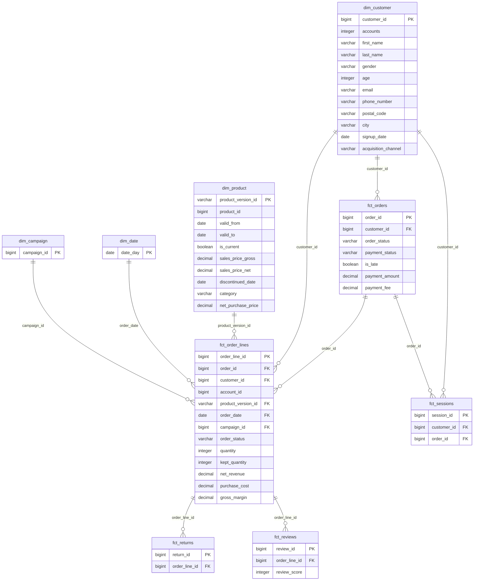

# Star schema (core)

<!-- generated by scripts/make_docs.py from the dbt manifest; do not edit -->

```mermaid
erDiagram
    dim_campaign {
        bigint campaign_id PK
    }
    dim_customer {
        bigint customer_id PK
        integer accounts
        varchar first_name
        varchar last_name
        varchar gender
        integer age
        varchar email
        varchar phone_number
        varchar postal_code
        varchar city
        date signup_date
        varchar acquisition_channel
    }
    dim_date {
        date date_day PK
    }
    dim_product {
        varchar product_version_id PK
        bigint product_id
        date valid_from
        date valid_to
        boolean is_current
        decimal sales_price_gross
        decimal sales_price_net
        date discontinued_date
        varchar category
        decimal net_purchase_price
    }
    fct_order_lines {
        bigint order_line_id PK
        bigint order_id FK
        bigint customer_id FK
        bigint account_id
        varchar product_version_id FK
        date order_date FK
        bigint campaign_id FK
        varchar order_status
        integer quantity
        integer kept_quantity
        decimal net_revenue
        decimal purchase_cost
        decimal gross_margin
    }
    fct_orders {
        bigint order_id PK
        bigint customer_id FK
        varchar order_status
        varchar payment_status
        boolean is_late
        decimal payment_amount
        decimal payment_fee
    }
    fct_returns {
        bigint return_id PK
        bigint order_line_id FK
    }
    fct_reviews {
        bigint review_id PK
        bigint order_line_id FK
        integer review_score
    }
    fct_sessions {
        bigint session_id PK
        bigint customer_id FK
        bigint order_id FK
    }
    dim_campaign ||--o{ fct_order_lines : "campaign_id"
    dim_customer ||--o{ fct_order_lines : "customer_id"
    dim_date ||--o{ fct_order_lines : "order_date"
    fct_orders ||--o{ fct_order_lines : "order_id"
    dim_product ||--o{ fct_order_lines : "product_version_id"
    dim_customer ||--o{ fct_orders : "customer_id"
    fct_order_lines ||--o{ fct_returns : "order_line_id"
    fct_order_lines ||--o{ fct_reviews : "order_line_id"
    dim_customer ||--o{ fct_sessions : "customer_id"
    fct_orders ||--o{ fct_sessions : "order_id"
```
