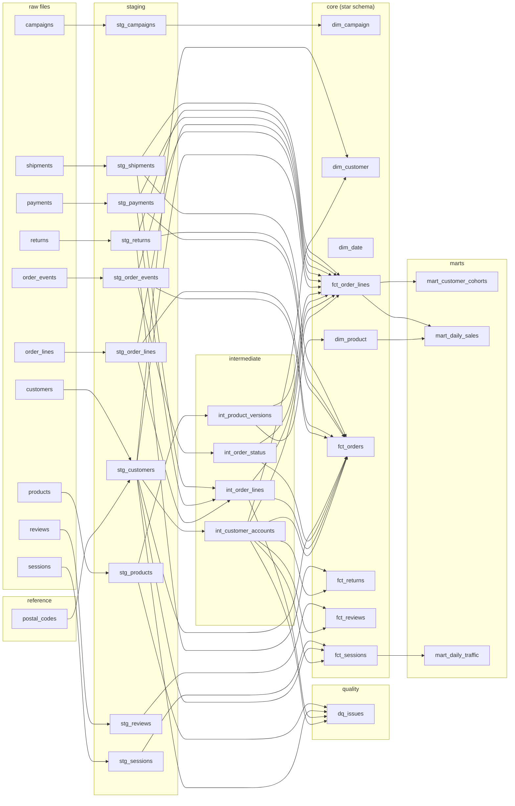

# Lineage of the dbt models

<!-- generated by scripts/make_docs.py from the dbt manifest; do not edit -->

```mermaid
flowchart LR
    subgraph source["raw files"]
        source_campaigns[campaigns]
        source_customers[customers]
        source_order_events[order_events]
        source_order_lines[order_lines]
        source_payments[payments]
        source_products[products]
        source_returns[returns]
        source_reviews[reviews]
        source_sessions[sessions]
        source_shipments[shipments]
    end
    subgraph seed["reference"]
        seed_postal_codes[postal_codes]
    end
    subgraph staging["staging"]
        staging_stg_campaigns[stg_campaigns]
        staging_stg_customers[stg_customers]
        staging_stg_order_events[stg_order_events]
        staging_stg_order_lines[stg_order_lines]
        staging_stg_payments[stg_payments]
        staging_stg_products[stg_products]
        staging_stg_returns[stg_returns]
        staging_stg_reviews[stg_reviews]
        staging_stg_sessions[stg_sessions]
        staging_stg_shipments[stg_shipments]
    end
    subgraph intermediate["intermediate"]
        intermediate_int_customer_accounts[int_customer_accounts]
        intermediate_int_order_lines[int_order_lines]
        intermediate_int_order_status[int_order_status]
        intermediate_int_product_versions[int_product_versions]
    end
    subgraph quality["quality"]
        quality_dq_issues[dq_issues]
    end
    subgraph core["core (star schema)"]
        core_dim_campaign[dim_campaign]
        core_dim_customer[dim_customer]
        core_dim_date[dim_date]
        core_dim_product[dim_product]
        core_fct_order_lines[fct_order_lines]
        core_fct_orders[fct_orders]
        core_fct_returns[fct_returns]
        core_fct_reviews[fct_reviews]
        core_fct_sessions[fct_sessions]
    end
    subgraph marts["marts"]
        marts_mart_customer_cohorts[mart_customer_cohorts]
        marts_mart_daily_sales[mart_daily_sales]
        marts_mart_daily_traffic[mart_daily_traffic]
    end
    core_dim_product --> marts_mart_daily_sales
    core_fct_order_lines --> marts_mart_customer_cohorts
    core_fct_order_lines --> marts_mart_daily_sales
    core_fct_sessions --> marts_mart_daily_traffic
    intermediate_int_customer_accounts --> core_dim_customer
    intermediate_int_customer_accounts --> core_fct_order_lines
    intermediate_int_customer_accounts --> core_fct_orders
    intermediate_int_customer_accounts --> core_fct_returns
    intermediate_int_customer_accounts --> core_fct_reviews
    intermediate_int_customer_accounts --> core_fct_sessions
    intermediate_int_customer_accounts --> quality_dq_issues
    intermediate_int_order_lines --> core_fct_order_lines
    intermediate_int_order_lines --> core_fct_orders
    intermediate_int_order_lines --> quality_dq_issues
    intermediate_int_order_status --> core_fct_order_lines
    intermediate_int_order_status --> core_fct_orders
    intermediate_int_product_versions --> core_dim_product
    intermediate_int_product_versions --> core_fct_order_lines
    seed_postal_codes --> staging_stg_customers
    source_campaigns --> staging_stg_campaigns
    source_customers --> staging_stg_customers
    source_order_events --> staging_stg_order_events
    source_order_lines --> staging_stg_order_lines
    source_payments --> staging_stg_payments
    source_products --> staging_stg_products
    source_returns --> staging_stg_returns
    source_reviews --> staging_stg_reviews
    source_sessions --> staging_stg_sessions
    source_shipments --> staging_stg_shipments
    staging_stg_campaigns --> core_dim_campaign
    staging_stg_customers --> core_dim_customer
    staging_stg_customers --> core_fct_order_lines
    staging_stg_customers --> core_fct_orders
    staging_stg_customers --> core_fct_sessions
    staging_stg_customers --> intermediate_int_customer_accounts
    staging_stg_customers --> quality_dq_issues
    staging_stg_order_events --> core_fct_order_lines
    staging_stg_order_events --> core_fct_orders
    staging_stg_order_events --> intermediate_int_order_status
    staging_stg_order_lines --> core_fct_order_lines
    staging_stg_order_lines --> core_fct_orders
    staging_stg_order_lines --> intermediate_int_order_lines
    staging_stg_payments --> core_fct_order_lines
    staging_stg_payments --> core_fct_orders
    staging_stg_payments --> intermediate_int_order_lines
    staging_stg_products --> intermediate_int_product_versions
    staging_stg_products --> quality_dq_issues
    staging_stg_returns --> core_fct_order_lines
    staging_stg_returns --> core_fct_orders
    staging_stg_returns --> core_fct_returns
    staging_stg_reviews --> core_fct_reviews
    staging_stg_sessions --> core_fct_sessions
    staging_stg_shipments --> core_fct_order_lines
    staging_stg_shipments --> core_fct_orders
    staging_stg_shipments --> intermediate_int_order_lines
```
